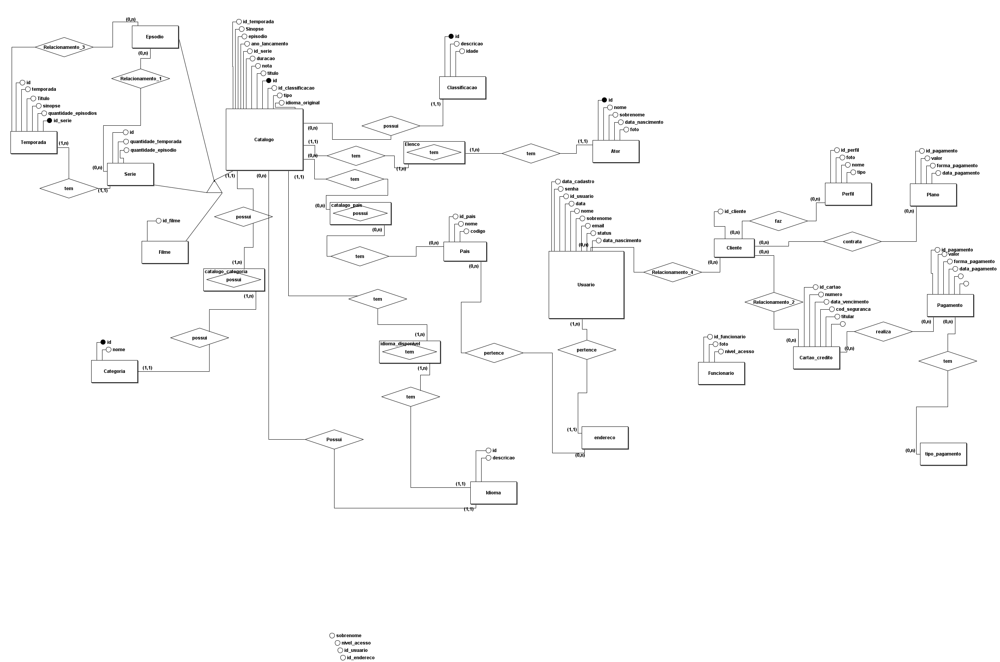
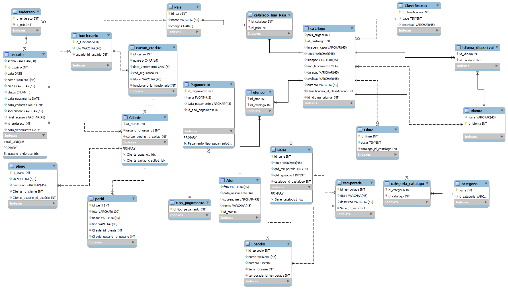

# Projeto Banco de dados

Este projeto tem intuito de demonstrar o conteudo aprendido em sala de aula no curso de **DBA**, para insto foi escolhido um banco de dados para plataformas de streaming.

## Modelo Conceitual

## Modelo Logico

## Tabelas

- tb_pais  
- tb_tipo_pagamento
- tb_pagamento
- tb_endereço
- tb_usuario
- tb_funcionario 
- tb_cartao_credito
- tb_ator
- tb_classificação 
- tb_idioma
- tb_catalogo
- tb_serie
- tb_temporada
- tb_categoria
- tb_plano
- tb_cliente
- tb_perfil
- tb_catalogo_pais
- tb_idioma_disponivel
- tb_elenco
- tb_categoria_catalogo
- tb_filme
- tb_episodio 

## Views

- **View1: vw_catalogo: vw_catalogo - Esta visualização contem todos os dados do catalogo, identificando series e filmes. 
- **View2: vw_usuario Esta visualização contem todos os dados de todos os usuários, como também, mostra quais os funcionários e quais são clientes, o endereço de cada um e seu pais de origem,  quantos perfis cada um tem e qual é o seu plano.
- **View3: vw_episodio - Esta visualização deve contem todos os dados dos episódios, qual sua serie, e de qual temporada ele é.
- **View4: vw_ator - Contem todos os dados dos atores, quantidades de filmes feito por ele, quantidade de series feita por ele.
- **View5: vw_perfil deve conter todos os dados do perfil e seu cliente.

## Procedures

- **Procedures1: Todas as procedures de INSERT, UPDATE e das respectivas tabelas.

## Scripts

|Scripts    |Clique aqui|
|-----------|-----------|
|DDL        |[Clique aqui](.//Scriptcriacaotabelas/Scriptcriacaotabelas.sql)|
|Dados      |[Clique aqui](.//Scriptinsertescolunas/Scriptinsertescolunas.sql)|
|Views      |[Clique aqui](./views/VIEWS.sql)|
|Procedures |[Clique aqui](./UpdateProcidures/Updateprocidures.sql)|
|Procedures |[Clique aqui](./InsertProcedures/Insertprocedures.sql)|

## Contatos

